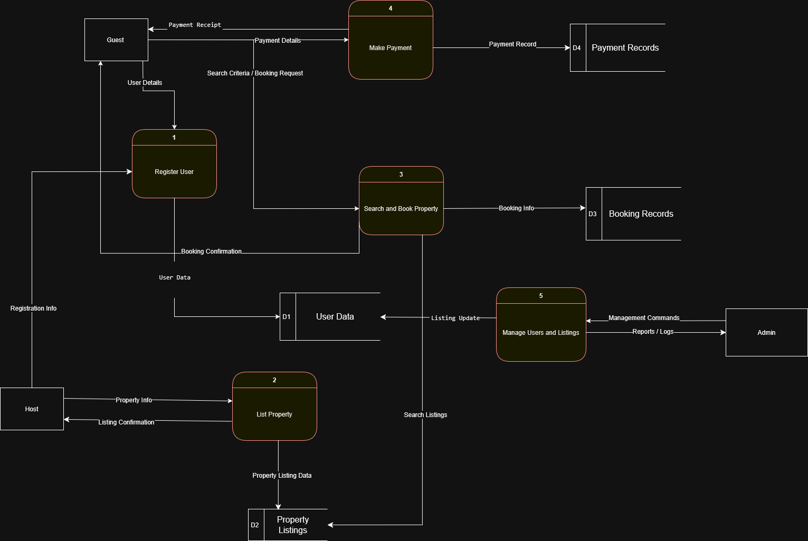

# Airbnb Clone – Data Flow Diagram

This diagram illustrates the core data flow between users, system processes, and internal data stores such as users, listings, bookings, and payments. It is drawn using Gane & Sarson notation and represents a Level 1 DFD.

