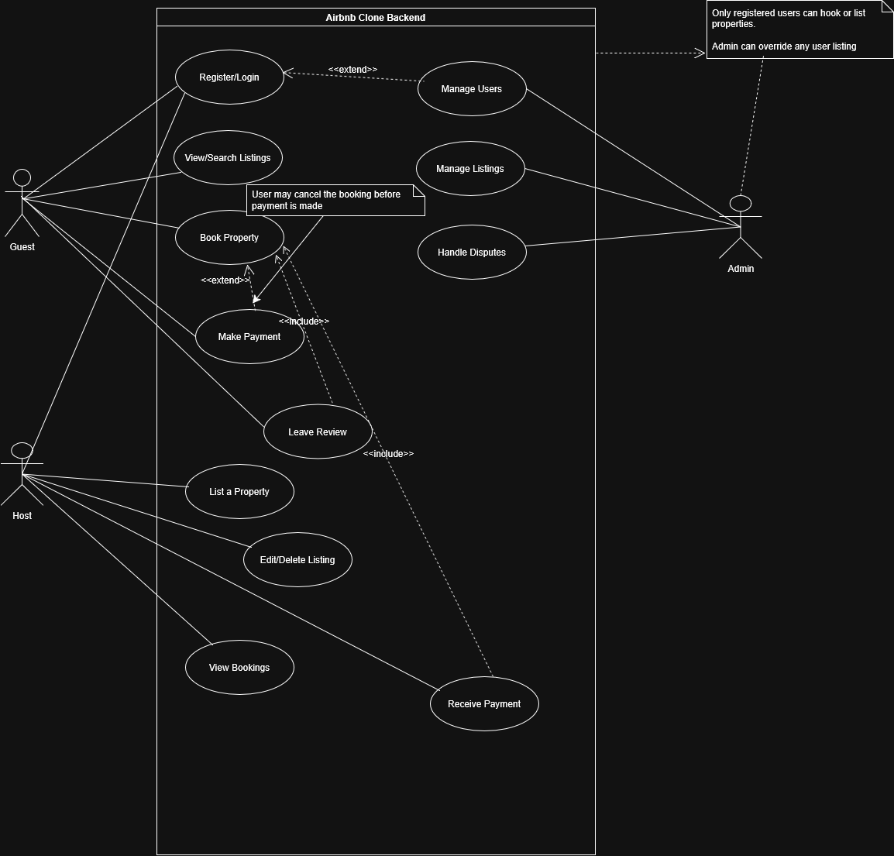

# 🧠 Airbnb Clone – Use Case Diagram

This diagram shows the interactions between key users (Guest, Host, Admin) and the system. It visualizes features such as registration, booking, payments, and management functionalities.

